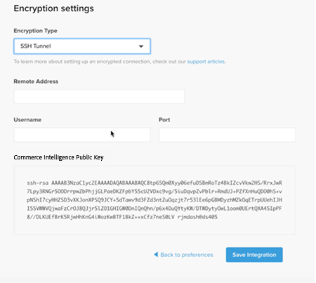

# Activer votre compte [!DNL Commerce Intelligence] pour les abonnements On-Premise et de démarrage

Pour activer les [!DNL Commerce Intelligence] pour les abonnements on-premise, commencez par créer un compte [!DNL Commerce Intelligence], saisissez vos informations de paramètres, puis connectez-[!DNL Commerce Intelligence] à votre base de données [!DNL Commerce]. <!-- For information about activation in `Cloud Starter` projects, see [Activating your [!DNL Commerce Intelligence] Account for `Cloud Starter` Subscriptions](../getting-started/cloud-activation.md).-->

## Créer votre compte [!DNL Commerce Intelligence]

Pour créer votre compte, contactez l’équipe chargée de votre compte Adobe ou le conseiller technique client.

## Création de votre mot de passe

Une fois votre compte créé, recherchez dans votre e-mail un e-mail de notification de compte provenant de l’adresse [!DNL The Magento BI Team@rjmetrics.com]. Utilisez le lien fourni dans l’e-mail pour accéder à votre compte [!DNL Commerce Intelligence] et créer votre mot de passe. Accédez à votre boîte de réception et vérifiez votre adresse e-mail.

Si vous n’avez pas reçu d’e-mail, [contactez l’assistance](https://experienceleague.adobe.com/docs/commerce-knowledge-base/kb/troubleshooting/miscellaneous/mbi-service-policies.html?lang=fr).

## Définition des préférences de votre boutique

Avant de configurer la connexion à la base de données, remplissez le formulaire d’informations du magasin. Ces informations sont requises pour terminer la configuration du **[!UICONTROL Connect your Database]**.

## Ajouter [!DNL Commerce Intelligence] utilisateurs

Après avoir défini votre mot de passe et vous être connecté à [!DNL Commerce Intelligence], vous pouvez ajouter d’autres utilisateurs à votre compte [!DNL Commerce Intelligence]. Lors de l’ajout d’utilisateurs, ajoutez des utilisateurs administrateurs disposant des autorisations appropriées pour terminer le processus d’activation.

## Créez un utilisateur [!DNL Commerce Intelligence] dédié dans l’administration [!DNL Commerce]

Pour utiliser [!DNL Commerce Intelligence], vous devez ajouter un utilisateur permanent et dédié au projet [!DNL Commerce]. Cet utilisateur dédié sert de connexion permanente à [!DNL Commerce] qui permet la récupération et le transfert de nouvelles données vers le Data Warehouse [!DNL Commerce Intelligence] du compte.

La configuration d’un utilisateur [!DNL Commerce Intelligence] dédié garantit que le compte n’est pas désactivé ni supprimé, ce qui interrompt la connexion [!DNL Commerce Intelligence].

>[!NOTE]
>
>Adobe encourage à utiliser un nom de compte qui indique son statut permanent (par exemple, ACI-dédié, ACI-database-connector, etc.).

Après avoir créé l’utilisateur dédié pour [!DNL Commerce Intelligence] dans Admin, ajoutez le même utilisateur à l’environnement principal du projet [!DNL Commerce] avec un paramètre **[!UICONTROL Master]** de `Contributor`.

## Obtenir vos clés SSH Commerce Intelligence

1. Sur la page [!UICONTROL Connect your database] pour la configuration des [!DNL Commerce Intelligence], faites défiler la page vers le bas et sélectionnez **[!UICONTROL Encryption settings]**.

1. Pour **Type de chiffrement**, sélectionnez `SSH Tunnel`.

1. Dans la liste déroulante, copiez la clé publique fournie.

   

## Ajoutez votre clé publique au [!DNL Commerce Intelligence]

1. À partir du [!DNL Commerce Admin], connectez-vous à l’aide des informations de connexion de l’utilisateur [!DNL Commerce Intelligence] que vous venez de créer.

1. Sélectionnez l’onglet **Paramètres du compte**.

1. Faites défiler vers le bas et développez la liste déroulante **[!UICONTROL SSH Keys]** . Sélectionnez ensuite **[!UICONTROL Add a public key]**.

   

1. Collez la clé publique que vous avez copiée à l’étape [!DNL Encryption Type] ci-dessus.

   

## Fournir des informations d’identification [!DNL Commerce Intelligence] `MySQL` Essentials

1. Mettez à jour votre `.magento/services.yaml`.

   

1. Mettez à jour votre `.magento.app.yaml`.

   

## Obtenir les informations de connexion à la base de données

Obtenir les informations de connexion à la base de données [!DNL Commerce] à [!DNL Commerce Intelligence]

1. Exécutez la commande suivante pour obtenir vos informations.

   `echo $MAGENTO_CLOUD_RELATIONSHIPS | base64 --decode | json_pp`

1. Passez en revue les informations de la base de données, qui doivent ressembler à l’exemple suivant.

   

## Connectez [!DNL Commerce Intelligence] à votre base de données [!DNL Commerce] à l’aide d’une connexion chiffrée

>[!NOTE]
>
>Adobe recommande vivement d’utiliser un tunnel [`SSH tunnel`](../data-analyst/importing-data/integrations/mysql-via-ssh-tunnel.md) pour établir la connexion à la base de données. Toutefois, si cette méthode n’est pas disponible, vous pouvez tout de même lier les [!DNL Commerce Intelligence] à votre base de données à l’aide d’un [`direct connection`](../data-analyst/importing-data/integrations/mysql-via-a-direct-connection.md).

Saisissez vos informations de [!DNL Commerce Intelligence] dans l’écran [!UICONTROL Connect your Magento Database].

**Entrées:**

[!UICONTROL Integration Name] : [choisissez un nom pour votre instance [!DNL Commerce Intelligence]]

[!UICONTROL Host]: `mbi.internal`

[!UICONTROL Port]: `3306`

[!UICONTROL Nom d&#39;utilisateur]: `mbi`

[!UICONTROL Password] : [ mot de passe de saisie affiché dans la section précédente]

[!UICONTROL Database Name]: `main`

[!UICONTROL Table Prefixes] : [laisser vide s’il n’existe aucun préfixe de tableau]

## Définissez vos paramètres [!UICONTROL **Fuseau horaire**]

**Entrées:**

[!UICONTROL Database Timezone]: `UTC`

[!UICONTROL Desired Timezone] : [choisissez le fuseau horaire pour lequel vous souhaitez que vos données s’affichent]

## Obtenir les informations sur vos paramètres de chiffrement

L’interface utilisateur du projet fournit une chaîne d’accès SSH. Cette chaîne peut être utilisée pour collecter les informations nécessaires pour les [!UICONTROL **Adresse distante**] et [!UICONTROL **Nom d’utilisateur**]. Utilisez la chaîne d’accès SSH en sélectionnant le bouton d’accès au site dans la branche de Principal de l’interface utilisateur du projet. Ensuite, trouvez vos [!UICONTROL User Name] et [!UICONTROL Remote Address] comme illustré ci-dessous.

## Saisie des paramètres du [!DNL Encryption]

**Entrées:**

[!UICONTROL Encryption Type] : `SSH Tunnel`

[!UICONTROL Remote Address] : `ssh.us-3.magento.cloud` [de l’étape précédente]

[!UICONTROL Username] : `vfbfui4vmfez6-master-7rqtwti—mymagento` [de l’étape précédente]

[!UICONTROL Port]: `22`

## Enregistrez votre intégration.

Une fois les étapes de configuration terminées, appliquez les modifications en sélectionnant [!UICONTROL **Enregistrer l’intégration**].

Vous avez maintenant correctement connecté votre base de données [!DNL Commerce] à votre compte [!DNL Commerce Intelligence].

>[!NOTE]
>
>Si vous êtes un client [!DNL Adobe Commerce Intelligence Pro], contactez votre responsable du succès client ou votre conseiller technique client pour coordonner les étapes suivantes.

Une fois la configuration terminée, [connectez-vous](../getting-started/sign-in.md) à votre compte [!DNL Commerce Intelligence].

<!---# Activate your [!DNL Commerce Intelligence] Account

To activate [!DNL Commerce Intelligence] for on-premise or `Cloud Pro` subscriptions, [contact support](https://experienceleague.adobe.com/docs/commerce-knowledge-base/kb/troubleshooting/miscellaneous/mbi-service-policies.html?lang=fr).

>[!NOTE]
>
>Adobe no longer supports new `Cloud Starter` subscriptions.--->
