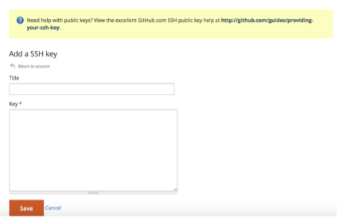
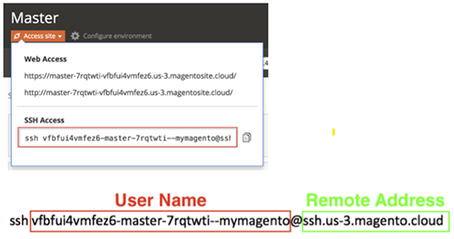

# Activez votre [!DNL Commerce Intelligence] Compte pour les abonnements On-Premise et Starter

Pour activer [!DNL Commerce Intelligence] pour les abonnements on-premise, commencez par créer un [!DNL Commerce Intelligence] compte, saisissez vos informations de paramètres, puis connectez-vous [!DNL Commerce Intelligence] à votre [!DNL Commerce] base de données. <!-- For information about activation in `Cloud Starter` projects, see [Activating your [!DNL Commerce Intelligence] Account for `Cloud Starter` Subscriptions](../getting-started/cloud-activation.md).-->

## Créez votre [!DNL Commerce Intelligence] account

Pour créer votre compte, contactez votre équipe de compte d’Adobe ou votre conseiller technique client.

## Créer votre mot de passe

Une fois votre compte créé, recherchez un courrier électronique de notification de compte provenant de [!DNL The Magento BI Team@rjmetrics.com]. Utilisez le lien fourni dans l’email pour accéder à votre [!DNL Commerce Intelligence] et créez votre mot de passe. Accédez à votre boîte de réception et vérifiez votre adresse électronique.

Si vous n’avez pas reçu d’e-mail, [support technique](https://experienceleague.adobe.com/docs/commerce-knowledge-base/kb/troubleshooting/miscellaneous/mbi-service-policies.html?lang=en).

## Définition des préférences de stockage

Avant de configurer la connexion à la base de données, remplissez le formulaire d’informations de magasin. Ces informations sont requises pour que la variable **[!UICONTROL Connect your Database]** configuration.

## Ajouter [!DNL Commerce Intelligence] utilisateurs

Après avoir défini votre mot de passe et vous être connecté à [!DNL Commerce Intelligence], vous pouvez ajouter d’autres utilisateurs à votre [!DNL Commerce Intelligence] compte . Lors de l’ajout d’utilisateurs, ajoutez des utilisateurs administrateurs avec les autorisations appropriées pour terminer le processus d’activation.

## Créer un [!DNL Commerce Intelligence] dans le [!DNL Commerce] admin

Pour utiliser [!DNL Commerce Intelligence], vous devez ajouter un utilisateur permanent et dédié à la variable [!DNL Commerce] projet. Cet utilisateur dédié sert de connexion permanente à [!DNL Commerce] qui permet la récupération et le transfert de nouvelles données vers le [!DNL Commerce Intelligence] Data Warehouse.

Configuration d’un [!DNL Commerce Intelligence] L’utilisateur s’assure que le compte n’est pas désactivé ni supprimé, ce qui arrête la variable [!DNL Commerce Intelligence] connexion.

>[!NOTE]
>
>Adobe recommande l’utilisation d’un nom de compte qui indique son statut permanent (par exemple, dédié à l’ITIP, connecteur de base de données ACI, etc.).

Après avoir créé l’utilisateur dédié pour [!DNL Commerce Intelligence] dans l’administrateur, ajoutez le même utilisateur à l’environnement principal de la fonction [!DNL Commerce] avec un projet **[!UICONTROL Master]** paramètre de `Contributor`.

## Obtention des clés SSH de Commerce Intelligence

1. Sur le [!UICONTROL Connect your database] page pour [!DNL Commerce Intelligence] configuration, faites défiler la page vers le bas et sélectionnez **[!UICONTROL Encryption settings]**.

1. Pour **Type de chiffrement**, sélectionnez `SSH Tunnel`.

1. Dans la liste déroulante, copiez la clé publique fournie.

   

## Ajoutez votre clé publique au [!DNL Commerce Intelligence]

1. Dans la [!DNL Commerce Admin], connectez-vous à l’aide des informations de connexion pour le [!DNL Commerce Intelligence] utilisateur que vous venez de créer.

1. Sélectionnez la variable **Paramètres du compte** .

1. Faites défiler l’écran vers le bas et développez **[!UICONTROL SSH Keys]** menu déroulant. Sélectionnez ensuite **[!UICONTROL Add a public key]**.

   

1. Collez la clé publique copiée dans la variable [!DNL Encryption Type] étape supérieure.

   

## Fournir [!DNL Commerce Intelligence] Essentials `MySQL` informations

1. Mettez à jour votre `.magento/services.yaml`.

   

1. Mettez à jour votre `.magento.app.yaml`.

   

## Obtention des informations de connexion à la base de données

Obtenez les informations de connexion à la base de données dans la [!DNL Commerce] vers la base de données [!DNL Commerce Intelligence]

1. Pour obtenir vos informations, procédez comme suit.

   `echo $MAGENTO_CLOUD_RELATIONSHIPS | base64 --decode | json_pp`

1. Consultez les informations de la base de données, qui doivent ressembler à l’exemple suivant.

   

## Connexion [!DNL Commerce Intelligence] à votre [!DNL Commerce] base de données à l’aide d’une connexion cryptée

>[!NOTE]
>
>Adobe recommande vivement d’utiliser une [`SSH tunnel`](../data-analyst/importing-data/integrations/mysql-via-ssh-tunnel.md) tunnel pour établir la connexion à la base de données. Cependant, si cette méthode n’est pas une option, vous pouvez toujours lier [!DNL Commerce Intelligence] à votre base de données à l’aide d’un [`direct connection`](../data-analyst/importing-data/integrations/mysql-via-a-direct-connection.md).

Saisissez votre [!DNL Commerce Intelligence] dans la variable [!UICONTROL Connect your Magento Database] écran.

**Entrées :**

[!UICONTROL Integration Name]: [choisissez un nom pour votre [!DNL Commerce Intelligence] instance]

[!UICONTROL Host]: `mbi.internal`

[!UICONTROL Port]: `3306`

[!UICONTROL Nom d’utilisateur]: `mbi`

[!UICONTROL Password]: [mot de passe de saisie affiché dans la section précédente]

[!UICONTROL Database Name]: `main`

[!UICONTROL Table Prefixes]: [laisser vide s’il n’y a aucun préfixe de tableau]

## Définissez vos [!UICONTROL **Fuseau horaire**] paramètres

**Entrées :**

[!UICONTROL Database Timezone]: `UTC`

[!UICONTROL Desired Timezone]: [choisissez le fuseau horaire pour lequel vous souhaitez que vos données s’affichent]

## Obtention des informations sur les paramètres de chiffrement

L’interface utilisateur du projet fournit une chaîne d’accès SSH. Cette chaîne peut être utilisée pour collecter les informations nécessaires pour la variable [!UICONTROL **Adresse distante**] et [!UICONTROL **Nom d’utilisateur**]. Utilisez la chaîne d’accès SSH en sélectionnant le bouton du site d’accès sur la branche Principal de l’interface utilisateur de projet. Recherchez ensuite votre [!UICONTROL User Name] et [!UICONTROL Remote Address] comme illustré ci-dessous.

## Saisissez votre [!DNL Encryption] paramètres

**Entrées :**

[!UICONTROL Encryption Type]: `SSH Tunnel`

[!UICONTROL Remote Address]: `ssh.us-3.magento.cloud`  [de l’étape précédente]

[!UICONTROL Username]: `vfbfui4vmfez6-master-7rqtwti—mymagento`  [de l’étape précédente]

[!UICONTROL Port]: `22`

## Enregistrez votre intégration.

Une fois les étapes de configuration terminées, appliquez les modifications en sélectionnant [!UICONTROL **Enregistrement de l’intégration**].

Vous avez maintenant réussi à connecter votre [!DNL Commerce] vers votre base de données [!DNL Commerce Intelligence] compte .

>[!NOTE]
>
>Si vous êtes un [!DNL Adobe Commerce Intelligence Pro] contactez votre client, contactez votre responsable du succès client ou votre conseiller technique client pour coordonner les étapes suivantes.

Une fois la configuration terminée, [connexion](../getting-started/sign-in.md) à votre [!DNL Commerce Intelligence] compte .

<!---# Activate your [!DNL Commerce Intelligence] Account 

To activate [!DNL Commerce Intelligence] for on-premise or `Cloud Pro` subscriptions, [contact support](https://experienceleague.adobe.com/docs/commerce-knowledge-base/kb/troubleshooting/miscellaneous/mbi-service-policies.html).

>[!NOTE]
>
>Adobe no longer supports new `Cloud Starter` subscriptions.--->
