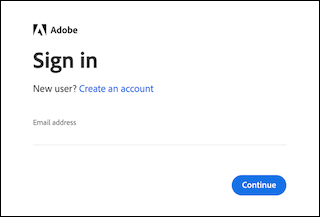

# Accéder à [!DNL MBI] account

Après avoir activé votre [!DNL MBI] compte soit pour [on-premise](../getting-started/onpremise-activation.md) ou [cloud](../getting-started/cloud-activation.md) et que vous avez travaillé avec votre gestionnaire de succès client pour finaliser les étapes de configuration, vous pouvez maintenant vous connecter à votre compte.

Vous pouvez vous connecter avec votre [!DNL Adobe ID] ou en utilisant [!DNL MBI] adresse électronique et mot de passe.

## Connectez-vous à l’aide de votre [!DNL Adobe ID]

1. Cliquez sur **[!UICONTROL Sign in with Adobe ID]**.

   

1. Entrez l’adresse électronique que vous avez utilisée lors de la création de votre [!DNL MBI] compte . Si vous ne disposez pas déjà d’un compte d’Adobe, cliquez sur **[!UICONTROL Create an account]** et saisissez vos informations. N’oubliez pas d’utiliser l’adresse électronique que vous avez utilisée lors de la création de votre [!DNL MBI] compte . L’adresse électronique est la clé dont vous avez besoin pour accéder à votre compte d’Adobe.

>[!NOTE]
>
>Si vous vous connectez en utilisant votre [!DNL Adobe ID], vous ne pourrez pas modifier votre [!DNL MBI] mot de passe du profil.

## Connexion à l’aide de votre nom d’utilisateur et de votre mot de passe

Saisissez votre adresse électronique et votre mot de passe, puis cliquez sur **[!UICONTROL Sign In]**.

Vous avez désormais accès à [!DNL MBI].
