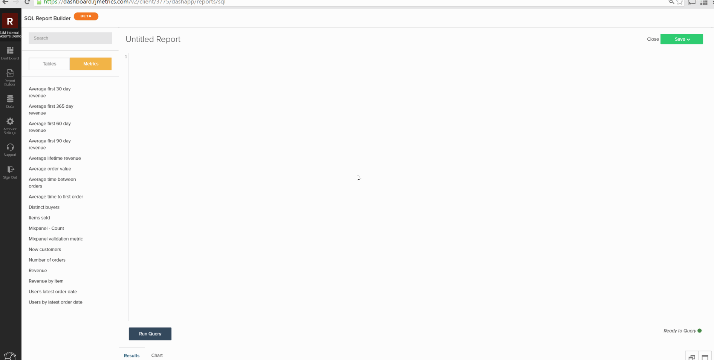

# Création de visualisations à partir de requêtes SQL

L’objectif de ce tutoriel est de vous familiariser avec la terminologie utilisée dans le [!DNL SQL Report Builder] et de vous donner une base solide pour créer des `SQL visualizations`.

Le [[!DNL SQL Report Builder]](../data-analyst/dev-reports/sql-rpt-bldr.md) est un Report Builder avec des options : vous pouvez exécuter une requête dans le seul but de récupérer une table de données ou transformer ces résultats en rapport. Ce tutoriel explique comment créer une visualisation à partir d’une requête SQL.

## Terminologie

Avant de commencer ce tutoriel, reportez-vous à la terminologie suivante utilisée dans le `SQL Report Builder`.

- `Series` : la colonne que vous souhaitez mesurer est appelée série dans le Report Builder SQL. Les exemples courants sont `revenue`, `items sold` et `marketing spend`. Au moins une colonne doit être définie comme `Series` pour créer une visualisation.

- `Category` : la colonne que vous souhaitez utiliser pour segmenter vos données est appelée une `Category`. C’est tout comme la fonctionnalité `Group By` de la [`Visual Report Builder`](../data-user/reports/ess-rpt-build-visual.md). Par exemple, si vous souhaitez segmenter le chiffre d’affaires de durée de vie de vos clients en fonction de leur origine d’acquisition, la colonne contenant l’origine d’acquisition est spécifiée comme `Category`. Plusieurs colonnes peuvent être définies comme `Category`.

>[!NOTE]
>
>Les dates et horodatages peuvent également être utilisés comme `Categories`. Il s’agit simplement d’une autre colonne de données dans votre requête qui doit être formatée et classée selon les besoins dans la requête elle-même.

- `Labels` : ils sont appliqués sous forme de libellés sur l’axe X. Lors de l’analyse des tendances des données dans le temps, les colonnes Année et Mois sont spécifiées sous forme de libellés. Plusieurs colonnes peuvent être définies sur Libellé.

## Étape 1 : écrire la requête

Gardez à l’esprit les points suivants :

- Le [!DNL SQL Report Builder] utilise [`Redshift SQL`](https://docs.aws.amazon.com/redshift/latest/dg/c_redshift-and-postgres-sql.html).

- Si vous créez un rapport avec une série temporelle, veillez à `ORDER BY` la ou les colonnes d’horodatage. Cela permet de s’assurer que les horodatages sont tracés dans le bon ordre sur le rapport.

- La fonction `EXTRACT` est idéale pour analyser le jour, la semaine, le mois ou l’année de l’horodatage. Cela s’avère utile lorsque les `time interval` que vous souhaitez utiliser dans le rapport sont `daily`, `weekly`, `monthly` ou `yearly`.

Pour commencer, ouvrez le [!DNL SQL Report Builder] en cliquant sur **[!UICONTROL Report Builder** > **SQL Report Builder]**.

Prenons l’exemple de cette requête qui renvoie le nombre total mensuel d’articles vendus pour chaque produit :

```sql
    SELECT SUM("qty") AS "Items Sold", "products's name" AS "product name",
    EXTRACT(year from "Order date") AS "year",
    EXTRACT(month from "Order date") AS "month"
    FROM "items"
    WHERE "products's name" LIKE '%Jeans'
    GROUP BY  "products's name", "year","month"
    ORDER BY "year" ASC,"month" ASC
    LIMIT 3500
```

Cette requête renvoie cette table des résultats :


## Étape 2 : création de la visualisation

Avec ces résultats, *comment créer la visualisation ?* Pour commencer, cliquez sur l’onglet **[!UICONTROL Chart]** dans le volet `Results`. L’onglet `Chart settings` s’affiche.

Lorsqu’une requête est exécutée pour la première fois, le rapport peut sembler impénétrable, car toutes les colonnes de la requête sont tracées sous la forme d’une série :


Pour cet exemple, vous souhaitez qu’il s’agisse d’un graphique en courbes qui affiche une tendance au fil du temps. Pour le créer, utilisez les paramètres suivants :

- `Series` : sélectionnez la colonne `Items sold` comme `Series`, car vous souhaitez la mesurer. Une fois que vous avez défini une colonne `Series`, une seule ligne est tracée dans le rapport.

- `Category` : pour cet exemple, vous souhaitez afficher chaque produit sous la forme d’une ligne différente dans le rapport. Pour ce faire, définissez `Product name` comme `Category`.

- `Labels` : utilisez les colonnes `year` et `month` comme libellés sur l’axe X pour pouvoir afficher les `Items Sold` en tendance dans le temps.

>[!NOTE]
>
>La requête doit contenir une clause `ORDER BY` sur les libellés s’il s’agit de colonnes `date`/`time`.

Vous trouverez ci-dessous un aperçu rapide de la manière dont vous avez créé cette visualisation, depuis l’exécution de la requête jusqu’à la configuration du rapport :



## Étape 3 : sélection d’un `Chart Type`

Cet exemple utilise le type de graphique `Line`. Pour utiliser un autre `chart type`, cliquez sur les icônes situées au-dessus de la section des options du graphique pour le modifier :


## Étape 4 : enregistrer la visualisation

Si vous souhaitez réutiliser ce rapport, donnez-lui un nom et cliquez sur **[!UICONTROL Save]** dans le coin supérieur droit.

Dans la liste déroulante, sélectionnez `Chart` comme `Type`, puis un tableau de bord dans lequel enregistrer le rapport.

## Conclusion

Vous voulez aller un peu plus loin ? Consultez les [ bonnes pratiques relatives à l’optimisation des requêtes ](../best-practices/optimizing-your-sql-queries.md).
