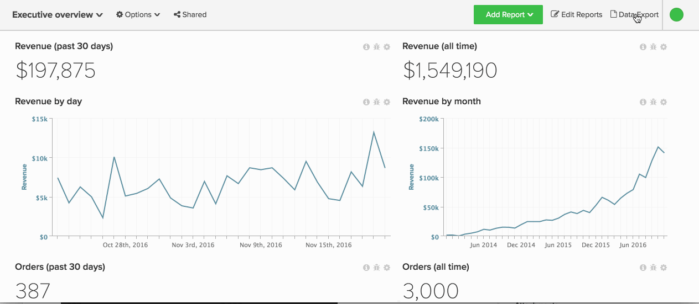

# Exporter les données brutes

Grâce aux exportations de données brutes, vous pouvez exporter des enregistrements de votre Data Warehouse pour mieux comprendre ce qui alimente votre tableau de bord. En outre, les exportations de données brutes peuvent vous aider [à identifier les incohérences de données](https://experienceleague.adobe.com/docs/commerce-knowledge-base/kb/troubleshooting/miscellaneous/using-data-exports-to-pinpoint-discrepancies.html).

Les exportations de données brutes donnent accès à des colonnes et dimensions supplémentaires, générées par la dénormalisation et la pré-agrégation des mesures pertinentes. Par exemple, `User's first order date` est une dimension que vous pouvez exporter pour chaque utilisateur dans [!DNL Commerce Intelligence], même si elle n’est pas disponible dans votre base de données.

Ce tutoriel aborde les sujets suivants :

* [Sélection des données à exporter](#select)
* [Téléchargement de l’exportation (](#download)
* [Accès aux exportations historiques](#historical)

## Etape 1 : sélection des données à exporter {#select}

Vous pouvez exporter des données brutes de deux manières différentes dans [!DNL Commerce Intelligence] :

1. au niveau du graphique
1. au niveau de la table

### Exportation au niveau du tableau dans votre onglet [!UICONTROL Manage Data]

Si vous souhaitez exporter le tableau à partir de [!UICONTROL Manage Data] onglet, vous avez besoin d’autorisations [Admin](../administrator/user-management/user-management.md).

1. Cliquez sur **[!UICONTROL Manage Data** > **&#x200B; Exporter les données &#x200B;**> **Exporter les données brutes]**.
1. Un `Export List` des exportations de données récemment créées s’affiche, le cas échéant. Cliquez sur **[!UICONTROL Add Export]** pour créer une exportation.
1. La boîte de dialogue `New Raw Data Export` s’affiche. Ici, vous pouvez personnaliser votre exportation en sélectionnant ou en désélectionnant les colonnes et les filtres :

   * `Table` - Le champ `Table` sélectionne la table à partir de laquelle les données sont exportées. Par défaut, le tableau dans lequel vous avez navigué s’affiche.
   * `Export Name` - Dans ce champ, saisissez le nom de l’exportation. Par exemple : `Philadelphia - Daily Revenue`.
   * `Available Columns` - Ce champ répertorie les colonnes (dimensions) de votre base de données qui peuvent être incluses dans l’exportation. Pour ajouter une colonne, cliquez sur son nom.
   * `Selected Columns` - Ce champ répertorie les colonnes (dimensions) actuellement incluses dans l’exportation. Pour supprimer une colonne, cliquez sur son nom.
   * `Filter` - Cette section répertorie les filtres actuellement appliqués à l’exportation. Ces filtres peuvent être modifiés ; de nouveaux filtres peuvent également être ajoutés pour exporter un jeu de données spécifique.
   * Lorsque vous avez terminé, cliquez sur **[!UICONTROL Export Data]**.

### Exportation au niveau du graphique depuis le tableau de bord

1. Cliquez sur l’icône d’engrenage dans le coin supérieur droit d’un graphique.

1. Sélectionnez `Raw Export` dans la liste déroulante pour afficher la boîte de dialogue `Raw Export`.

1. Personnalisez l’exportation en choisissant les `table`, `columns` et `filters` à inclure ou exclure. Reportez-vous à la section précédente pour plus d’informations sur les champs de ce module.

   >[!NOTE]
   >
   >Le tableau qui s’affiche dans le champ `Table` est, par défaut, le tableau qui alimente le graphique.

1. Lorsque vous avez terminé, cliquez sur **[!UICONTROL Export Data]**.

Examinez l’ensemble du processus au niveau des graphiques.

## Etape 2 : téléchargement de l&#39;export {#download}

Le traitement de l’exportation commencera immédiatement après avoir effectué vos sélections dans la boîte de dialogue `Raw Data Export`. Comme certaines exportations peuvent être volumineuses, elles sont limitées à 10 millions de lignes et peuvent prendre un certain temps.

Pour vérifier si votre exportation est prête, cliquez sur **[!UICONTROL Raw Data Exports]** dans le coin supérieur droit de l’écran. Cliquez sur **[!UICONTROL Download]** pour télécharger un fichier `.csv` compressé de votre exportation.

## Etape 3 : Accès Aux Exportations Historiques {#historical}

Pour afficher vos exportations précédentes, cliquez sur **[!UICONTROL Raw Data Export]** dans le coin supérieur droit de l’écran. Les rapports en attente et terminés peuvent être consultés pendant un maximum de sept jours.
