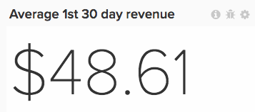

# Utilisez la variable [!DNL Visual Report Builder]

La variable [[!DNL Visual Report Builder]](../data-user/reports/ess-rpt-build-visual.md) vous permet d’explorer visuellement vos données afin d’obtenir des informations et de vous aider à prendre des décisions professionnelles. Ce tutoriel vous guide tout au long du processus de création d’un rapport de base.

>[!NOTE]
>
>Pour ajouter un rapport à un tableau de bord, vous devez `Standard` [permissions utilisateur](../administrator/user-management/user-management.md) et `Edit` accès au tableau de bord.

## Etape 1 : création d&#39;un rapport

Pour commencer à créer un rapport, cliquez sur **[!UICONTROL Report Builder]** dans la barre latérale ou **[!UICONTROL Add Report]** en haut de n’importe quel tableau de bord. Lorsque la variable `Report Builder` s’affiche, cliquez sur le bouton **[!UICONTROL Visual Report Builder]** .

Pour modifier un rapport créé dans le [!DNL Visual Report Builder], cliquez sur l’icône d’engrenage (Options) dans le coin supérieur droit d’un graphique, puis cliquez sur **[!UICONTROL Edit]**.

## Étape 2 : ajout de mesures

La première étape de la création d’une analyse consiste à sélectionner [la mesure](../data-user/reports/ess-manage-data-metrics.md) à analyser. Bien que les mesures soient répertoriées par défaut par ordre alphabétique, vous pouvez également les regrouper en fonction du tableau qui alimente la mesure.

Vous pouvez ajouter d’autres mesures une fois la mesure initiale sélectionnée et superposer toutes les mesures sur un seul rapport ou effectuer des calculs multimesures en ajoutant des formules.

## Étape 3 : ajout `Formulas`

`Formulas` sont ajoutés aux rapports en cliquant sur **[!UICONTROL Add Formula]**, situé juste au-dessus de la liste des mesures du rapport. Dans le [éditeur de formule](../data-analyst/dev-reports/formulas-in-rpt-bldr.md), toutes les mesures incluses dans le rapport peuvent être utilisées comme entrées. Les opérateurs mathématiques de base sont utilisés pour manipuler les différentes mesures.

Supposons que vous souhaitiez créer un rapport qui montre les recettes moyennes par commande. Dans ce cas, vous diviseriez le `Revenue` par la mesure `Number of orders` mesure.

## Étape 4 : définition de la variable `Time Period` et `Interval of Analysis` {#time}

Pour vous concentrer sur une période spécifique, vous pouvez définir la période de l’analyse. Vous pouvez également choisir des intervalles de temps pour segmenter les données (par exemple, par année, par trimestre ou par mois). Utilisez les menus dans le coin supérieur droit du graphique pour définir la période et l’intervalle.

Lorsque vous définissez une période spécifique pour cette période, assurez-vous que la date de début se trouve au début de l’intervalle et que la date de fin se trouve à la fin de l’intervalle.

Par exemple, la définition d’une période à partir de `January 1st` to `March 1st` et choisir un `monthly` l’intervalle affiche `March` comme point de données, mais ignorez tous les jours dans `March` Sauf `March 1`. Dans ce cas, vous devez effectuer votre `Time Period` de `January 1 to March 31`.

## Étape 5 : `Group by` / `Segmenting the Analysis` {#groupby}

[Pour segmenter vos mesures en fonction d’une dimension de données](../best-practices/segment-filter.md), cliquez sur le **[!UICONTROL Group by]** en haut à gauche du graphique. Cela révèle une liste déroulante comprenant toutes les dimensions disponibles de la première mesure incluse dans la liste.

Vous pouvez choisir `None` pour empêcher la segmentation d’une mesure. Par exemple, vous souhaitez peut-être une mesure qui renvoie les recettes totales sans être segmentée, tout en ayant une autre mesure de recettes segmentée par région.

Revenez à l’exemple de chiffre d’affaires moyen par commande et définissez le Group by sur code promotion. Vous affichez ainsi les recettes moyennes par commande pour les commandes avec et sans code promotion.

Si les mesures incluses dans l’analyse sont créées sur différents tableaux de données, une fenêtre contextuelle vous permet de sélectionner la dimension de données correspondante dans chaque tableau. L’objectif ici est de trouver des dimensions qui partagent des types de valeurs pour la segmentation :

## Étape 6 : définition `Metric Filters`, `Perspective`, et `Time Interval` {#metric-specific}

Pour chaque mesure ajoutée à l’analyse, vous pouvez ajouter des filtres, sélectionner la perspective de données appropriée et définir `time interval` options. Pour accéder à ces fonctionnalités, cliquez sur l’entonnoir (`Filter`), oeil (`Perspective`), et l’horloge (`Time`) en regard des mesures incluses dans le rapport.

### `Filters`

`Filters` limitez le jeu de données inclus dans l’analyse. Les filtres sont utiles, par exemple, lors de l’évaluation de canaux d’acquisition individuels et de la suppression de valeurs aberrantes.

Outre les menus déroulants et la zone de texte, vous pouvez également utiliser des opérateurs de filtrage spéciaux tels que `LIKE` ou `IN` pour créer des filtres.

Utilisation de caractères génériques (`%` ou `_`) avec `LIKE` Les instructions sont prises en charge. La variable `%` Un caractère générique correspond à plusieurs caractères, tandis que `_` correspond uniquement à n’importe quel caractère. Par exemple :

- `affiliate's name Like B%` autorise uniquement les données des clients dont le nom commence par `B`.

- `affiliate's name Like _ake` autorise uniquement les données des clients dont les noms ressemblent à `Jake`, `Rake`, ou `Bake` mais pas `Drake` ou `Blake`.

L’ajout de plusieurs filtres permet un contrôle strict des données du graphique. Par défaut, toutes les conditions de filtrage doivent être vraies pour qu’un élément de données soit inclus, mais vous pouvez créer des relations OU en modifiant la zone de texte Règles de filtrage .

### `Perspectives`

`Perspectives` Permet de basculer facilement entre différentes vues de vos données. Examinez les éléments disponibles :

- `Standard perspective`: la perspective standard vous montre le résultat de la date correspondante sur l’axe X (par exemple les recettes de janvier). C’est la perspective que vous utilisez dans votre exemple de revenu moyen par commande.

- `Amount` OU `Percent Change` versus `Previous Period` perspective : cette perspective indique le changement de montant ou de pourcentage d’un intervalle à l’autre et est utile pour mesurer le taux de changement dans les mesures à évolution rapide. Il existe également une perspective permettant de comparer l’intervalle à la même période l’année dernière pour afficher la croissance d’une année à l’autre.

- `Cumulative perspective`: la variable `cumulative perspective` affiche le montant de la somme en cours ou cumulée de la mesure au cours de la période. Il est souvent utilisé pour analyser le nombre total de clients et planifier une capacité future.

- `Percent of First Value perspective`: cette perspective affiche les données sous la forme d’un pourcentage de la première période incluse dans l’analyse. Cela s’avère utile pour mesurer l’efficacité d’actions spécifiques par rapport aux performances de la première période.

- `Rolling averages window perspective`: la perspective de fenêtre des moyennes roulantes indique la valeur moyenne glissante d’une mesure sur une période donnée. L’intervalle doit être le même que l’intervalle défini au niveau du rapport. Si, par exemple, le rapport affiche le dernier trimestre complet des recettes par semaine, vous pouvez définir la période de fenêtre variable moyenne sur quatre semaines. Cela signifie que les trois premières valeurs sont nulles et que la quatrième valeur représente la moyenne des quatre premières semaines des recettes. Pour plus de clarté, veillez à désactiver la variable `Multiple Y-Axes` si vous affichez la même mesure avec une moyenne variable, comme dans l’exemple ci-dessous.

### Options d’heure spécifiques aux mesures

Il existe deux options pour les mesures utilisées dans les rapports : elles peuvent afficher la tendance au fil du temps en fonction des options temporelles globales, ou non, ce qui les affichera comme un nombre scalaire.

Modification de l’intervalle de temps d’une mesure en `None` renvoie une `scalar` nombre, ce qui est utile lors de la création de formules impliquant la division d’une mesure de tendance temporelle par une `scalar` Nombre. Vous pouvez également modifier la période de la variable `scalar` à une période indépendamment de celle du rapport.

Par exemple, vous vouliez voir les recettes mensuelles 2019 exprimées en pourcentage du chiffre d’affaires global de 2019. Vous pouvez ajouter deux `Revenue` mesures d’un rapport avec une période globale du 1er janvier 2019 au 31 décembre 2019, segmentée par intervalle mensuel.

>[!NOTE]
>
>Si vous ajoutez `group by` dimensions, sélectionnez une nouvelle visualisation ou ajustez l’intervalle de temps, puis enregistrez uniquement le nombre (`scalar`). Ces ajustements ne sont pas conservés la prochaine fois que vous ouvrez ce rapport à partir d’un tableau de bord ; seule la période est conservée.

Pour en savoir plus sur l’utilisation des options de temps dans les rapports, voir [tutoriel](../tutorials/time-options-visual-rpt-bldr.md).

## Étape 7 : enregistrer le rapport

Lorsque vous créez un graphique, vous pouvez l’enregistrer en cliquant sur **[!UICONTROL Save]** dans le coin supérieur droit du `Visual Report Builder`.

Vous pouvez choisir d’enregistrer un graphique, un tableau ou un nombre (`scalar`) en utilisant la variable `Type` et le tableau de bord auquel le rapport doit être enregistré à l’aide de la variable `Location` menu déroulant.

Vous pouvez ensuite enregistrer le rapport en cliquant sur **[!UICONTROL Save to Dashboard]**.

## Sorties de rapport

Pour vous aider à choisir la sortie du rapport, reportez-vous aux sections suivantes :

### Graphique

### Tableau

### Nombre (`scalar`)

Félicitations ! Tu as fini.
